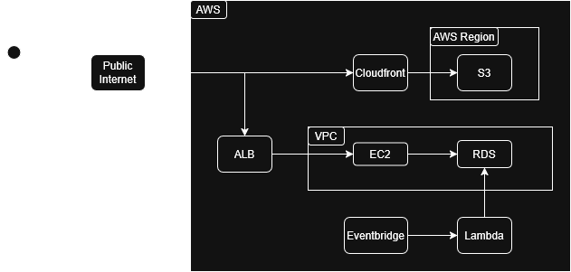

# SECFORM4 Project

This project is dedicated to tracking insider trading activity using SEC form 4 filing information.

The project has been built using the following list of technologies

- Python (FastAPI, Airflow, requests, Beautifulsoup, Pytest)
- React (Material UI, Typescript, Plotly)
- PostgreSQL
- AWS
    - no server-side rendering, so vite will use Cloudfront + S3
    - RDS will be used for postgres database
    - AWS EC2 will be used for REST API
    - AWS EventBridge and Lambda will be used for DB updates
- various other technologies (SQLAlchemy, XML, JSON, Swagger, Docker)
- devops: see if I can incorporate deploy on push to AWS with github actions

## Planned High Level System Design + Explanation

- Since I'm eligible, I'm planning to use the AWS free tier as much as possible until my credits run dry.
- Frontend:
    - Users are served static HTML/CSS/JavaScript files. These files will have code that will be responsible for making API calls to retrieve data from the API
- ALB (Application Load Balancer)
    - ALB allows for more security since users won't be accessing the EC2 instance directly via the static code. This will act as a proxy to the EC2 instance which sits securely in a VPC (Virtual Private Cloud)
- Backend:
    - API:
        - the FastAPI app will run on an EC2 instance. An alternative would be to use a combination of AWS API Gateway and AWS Lambda. However, from what I've read, using AWS Lambda would require cold starts for API calls, which would be a massive performance hit to the amount of time it takes to retrieve data via the API. using a plain EC2 instance will be a bit more complicated to set up, but there won't be cold starts, so users should have an overall better experience with how long it takes to retrieve data.
        - At the same time, if I want to run some basic selects on the Postgres instance for healthchecks, I can connect through the EC2 instance as well.
    - Database:
        - This is probably the most straight forward. Postgres will be used for the db enginer and RDS is the most logical option. Specifically, since I'm using the free tier which should give me 20GB of storage for free, which is more than enough at this point.
    - Database Updates:
        - a combination of EventBridge and Lambda is used. EventBridge will be used to schedule jobs based on a cron scheduler so that tasks can be run periodically. Specifically, I would like some script to be run in the background that will periodically update the DB with new data concerning insider transactions throughout the day. Lambda will have the function which will be run for data retrieval.

## Technical challenges
- redoing the chart components to save money so that I can get better performance using plotly graphs
    - improves rendering time/performance plus I get features like pan and zoom for free!
    - material ui charges a premium fee for that, which I didn't want to pay for
- the SEC does not provide a public api for form 4 data, so I had to find a way to create my own way to reliably get data to be saved and displayed to my frontend

## What I've learned
- front end development with React, Typescript, MUI, Plotly
- public cloud services
- systems design
- modern devops tooling (github actions)
- testing frameworks
- data pipeline development on windows (running apache airflow using Docker)
- batch processes on windows
    - adhoc scripts to gather data on a schedule on windows machines
- multithreading requests in python
    - although SEC throttles requests to be at most 10 requests per second, can try to maximize parallelism with multiprocessing in python

## Features to be developed
- sector overview
- alert system
    - Ideally, a site visitor can input their email and be notified when a specific company is being traded by an insider, or an insider is buying/selling
- refactor
    - better logging, failure detection, exception handling
    - be sure there's no issues with front end
        - are there memory leaks?

